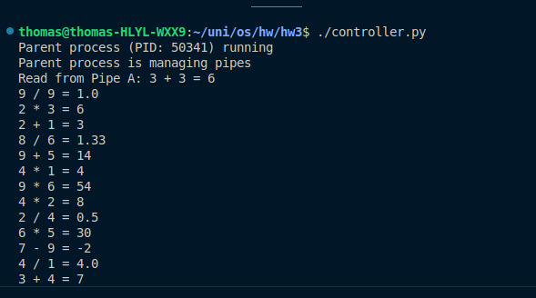
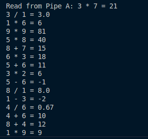

## Overview

The repo contains the implementation of `generator.py` and `controller.py`, that demonstrate inter-process communication using pipes in Python. The scripts utilizes system calls like `fork()`, `execve()`, `pipe()`, and `wait()`.

### Scripts

- `generator.py`: Generates random arithmetic expressions and outputs them.
- `controller.py`: Manages pipes, creates child processes, and processes arithmetic expressions using `generator.py` and `bc`.

### Execution Examples:

