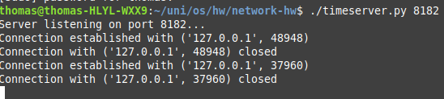
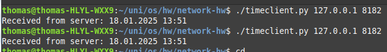

## Time Server & Client Application Task Briefing

client-server application that demonstrates communication using sockets. The server here sends the current date and time to the client, which then prints it to the console!

## 3 How to run??

1- Run the server via: ```bash ./timeserver.py 8182```

2- Run the client: ```bash ./timeclient.py 127.0.0.1 8182``` Loopback on the port `8182`

## Execution Example:

1- **Server:**



2- **CLients connections:**


